# Ticket Pricing at Big Mountain Resort

***(Source: Stanley.Com; Hotel used as The Overlook in "The Shining")***
# Summary
* The following analysis is the data wrangling/cleaning step in answering the question: What is the optimal ticket price might be for Big Mountain. 

* The data set contained 330 rows, each representing a resort, and 27 features.

* 34 states are included in the data set.

* Data integrity checks were run using .isnull, as were checks for missing values coded as "extreme" integers (e.g., -1, 999).

* An initial review of the data revealed the feature fastEight was missing ~50% of observations and, thus, was dropped.

* AdultWeekday and AdultWeekend data were missing ~16% and ~15% of values, respectively, both prices were present for our target resort.

* 47 resorts were missing both ticket prices, though only one was domiciled in Montana. These observations were dropped.

* Features such as SkiState and Region were disambiguated. 

* Our 38 regions were spread across 25 states. The variables failed to coincide 33 times owing to multiple divisions in CA, OR, and UT.

* Most prices were range bound between 25.00 and 100.00.

* 82% of resorts contain all data, while ~14% are missing at least one data point.

* Features of interest were identified based on a review of their respective distributions combined with knowledge of missing values and domain knowledge.

* Adjustments for missing values normalized some of their distributions, however, many have a distinctive positive skew due to the data's inability to go below zero for most predictors and potential outliers.

* Resort data were supplemented by state-level data fetched from the web. These data provided insight into state populations and total area.

* Per Montana specifically, more weekday prices were missing than weekend. The AdultWeekday feature was, therefore, dropped, and we will focus on modeling weekend pricing, going forward.

* Missing values across all resorts revealed a quantile pattern. This indicates systematic removal of information from this data set.
# 1. Problem Statement
How can Big Mountain (“the Company”) revise its pricing strategy to increase annual
revenue by at least $1.54 million over the next year? The question arises from the
Company’s recent investment in a chair lift that will increase operating expenses by
$1.54 million. The solution to this problem is a function of Big Mountain’s ability to
increase its prices relative to competitors, while maintaining consumers’ perception that
Big Mountain offers a strong value proposition.

In this study, we will use machine learning to answer the problem at hand. Plus, identify those assets for which skiiers will pay a premium (i.e., those assets in place that will support a premium price). 
We begin with data wrangling.

# 2. Data Wrangling

## 2.1 Imports
As usual, we being with our imports.
```python
import pandas as pd

import matplotlib.pyplot as plt
    
import numpy as np
    
import seaborn as sns

import os

from library.sb_utils import save_file
```
## 2.2 Objectives of Data Wrangling 
The following are the fundamental questions we must resolve in this notebook before we move on:

1. Do we have the data we need to tackle the desired question?

* Have we identified the required target value?
* Do we have potentially useful features?

2. Do we have any fundamental issues with the data?

## 2.3 Load The Ski Resort Data
```python
ski_data = pd.read_csv('../raw_data/ski_resort_data.csv')```

Below, we do an initial audit of the data.


ski_data.info

Name            Region    state         summit_elev  
__________________________________________________
Alyeska Resort   Alaska   Alaska         3939   
Eaglecrest Ski   Alaska   Alaska         2600   
Hilltop Ski      Alaska   Alaska         2090   
Arizona Snowbowl Arizona  Arizona        11500   
Sunrise Park     Arizona  Arizona        11100   
...                 
Meadowlark Ski   Wyoming  Wyoming         9500   
Sleeping Giant   Wyoming  Wyoming         7428   
Snow King        Wyoming  Wyoming         7808   
Snowy Range Ski  Wyoming  Wyoming         9663   
White Pine Ski   Wyoming  Wyoming         9500   

vertical_drop  base_elev  trams  fastEight  fastSixes  fastQuads
________________________________________________________________
2500            250         1      0.0          0          2  
1540            1200        0        0          0          0   
294             1796        0      0.0          0          0    
2300            9200        0      0.0          1          0 
1800            9200        0      NaN          0          1   
325             1000        8500     0        NaN          0          
326             810         6619     0        0.0          0           
327             1571        6237     0        NaN          0           
328             990         8798     0        0.0          0          329            1100         8400     0        NaN          0          

LongestRun_mi SkiableTerrain_ac  Snow Making_ac daysOpenLastYear
________________________________________________________________
    1.0            1610.0           113.0            150.0 
    2.0            640.0            60.0             45.0   
    1.0            30.0             30.0             150.0   
    2.0            777.0            104.0            122.0   
    1.2            800.0            80.0             115.0   
  ...   
    1.5            300.0            NaN               NaN   
    1.0            184.0            18.0              61.0   
    1.0            400.0            250.0             121.0   
    0.7             75.0            30.0              131.0   
    0.4            370.0            NaN               NaN   

    yearsOpen  averageSnowfall  AdultWeekday  AdultWeekend
___________________________________________________________
    60.0            669.0          65.0          85.0   
    44.0            350.0          47.0          53.0   
    36.0             69.0          30.0          34.0   
    81.0            260.0          89.0          89.0   
    49.0            250.0          74.0          78.0   
    ...   
    9.0              NaN            NaN           NaN            
    81.0            310.0           42.0          42.0   
    80.0            300.0           59.0          59.0   
    59.0            250.0           49.0          49.0   
    81.0            150.0           NaN          49.0   

        projectedDaysOpen  NightSkiing_ac
_________________________________________________________ 
    0                150.0           550.0  
    1                 90.0             NaN  
    2                152.0            30.0  
    3                122.0             NaN  
    4                104.0            80.0  
    ..                 ...             ...  
    325                NaN             NaN  
    326               77.0             NaN  
    327              123.0           110.0  
    328                NaN             NaN  
    329                NaN             NaN 
``` 

>The output above tells us we have a multi-state data set with various data types, in addition to a number of missing values.

Since we are working with data from multiple states, let's determine which states dominate the market for snow skiing.

```python ski_data['state'].value_counts()
State       Resort Count
_________________________________________________________
New York          33

Michigan          29

Colorado          22

California        21

Pennsylvania      19

New Hampshire     16

Wisconsin         16

Vermont           15

Minnesota         14

Utah              13

Idaho             12

Montana           12

Massachusetts     11

Washington        10

Oregon            10

New Mexico         9

Maine              9

Wyoming            8

North Carolina     6

Ohio               5

Connecticut        5

Nevada             4

West Virginia      4

Illinois           4

Virginia           4

Alaska             3

Iowa               3

Indiana            2

New Jersey         2

Arizona            2

Missouri           2

South Dakota       2

Tennessee          1

Rhode Island       1

Maryland           1

Name: state, dtype: int64
```

>New York, Michigan, and Colorado are our top three markets for ski resorts. Montana, the state in which our target resort is located, ranks 12th.

>The data set contains two ticket prices: `AdultWeekday` and `AdultWeekend`. 

Returning to our fundamental question of whether or not we have identified our target variable, we can only say, no, not quite yet. We have, however, narrowed it down to two candidates: `AdultWeekday` and `AdultWeekend`. We will revisit -- and definitively answer -- this question after reviewing more of our data.

>The output above indicates our ski-resort data are well organized. We have plausible column headings and can see one of the many missing values noted earlier.

Aside from the `AdultWeekday` and `AdultWeekend` data, the remaining columns are potential "features" (i.e., independent variables) we might include in a statistical/machine learning model. But are all of the features useful? 

It's difficult to tell how many features will be useful to us at this stage, however, the data look promising. For example, the `vertical_drop` at a resort would be of interest to any prospective skier. Intuitively, we know that high drops should be more popular among seasoned skiers than lower drops. 

`SkiableTerrain_ac` is manifestly important because it measures the acreage available for skiing. 

`NightSkiing_ac` measures the amount of acreage available for skiing during a particular day part, which implies some resorts may offer guests the opportunity to extend their ski day into the night. 

Resorts with more skiing acreage and skiing opportunities should be preferable to low acreage resorts that offer only daytime skiing. So, looking at these three variables alone, we can surmise that resorts offering large vertical drops, ample skiing terrain, and the opportunity to ski at night should command a price premium relative to resorts that do not.

We examined all features in the manner described above, asking ourselves if it was reasonable to assume any given variable could affect ticket price(s). We ultimately concluded all features could be potentially useful and should be retained for further analysis.

The number of features used in any model will likely be lower than the total number of features available. Thus, we have answered one of our aforementioned fundamental questions:

>We have the data we need to answer our research question. That said, should we find ourselves wanting for a piece of information, we can always supplement what we have with external data.      
    
## 2.4 Explore The Target Resort's Data
    
Our resort of interest is Big Mountain Resort. Let's explore the data we have on the property.

```python
ski_data[ski_data.Name == 'Big Mountain Resort'].T
```
# Big Mountain Resort
```python
Region:	Montana

state:	Montana

summit_elev:	6817

vertical_drop:	2353

base_elev:	4464

trams: 0

fastEight: 0.0

fastSixes:	0

fastQuads: 3

quad: 2

triple:	6

double:	0

surface: 3

total_chairs: 14

Runs: 105.0

TerrainParks: 4.0

LongestRun_mi: 3.3

SkiableTerrain_ac: 3000.0

Snow Making_ac: 600.0

daysOpenLastYear: 123.0

yearsOpen: 72.0

averageSnowfall:	333.0

AdultWeekday: 81.0

AdultWeekend: 81.0

projectedDaysOpen: 123.0

NightSkiing_ac: 600.0
```

Our resort doesn't appear to have any missing values, which is terrific! Missing values do, however, exist in our data frame.

### 2.4.1 Missing Values
Counting the number of missing values in each column and sorting them could help us determine if a feature should be kept or eliminated from our data set.

```python
missing = pd.concat([ski_data.isnull().sum(), 100*ski_data.isnull().mean()], axis = 1)
missing.columns=['count', '%']
missing.sort_values(by='%', ascending = False)
```
_________________________________________________________
    |variable|            |count|       |%|

    fastEight               166,        50%

    NightSkiing_ac	        143,	    43% 
                
    AdultWeekday	        54,	        16%
                
    AdultWeekend	        51,	        15%
                
    daysOpenLastYear        51,	        15%
                
    TerrainParks	        51,	        15%
                
    projectedDaysOpen       47,         14%
                
    SnowMaking_ac	        46,	        13%
                
    averageSnowfall	        14,	        4%
                
    LongestRun_mi	        5,	        1%
                
    Runs	                4,	        1%
                
    SkiableTerrain_ac       3,	        0.90%
                
    yearsOpen	            1,	        0.30%

    total_chairs	        0,	        0.0%
                
    Name	                0,	        0.0%
                
    Region	                0,	        0.0%
                
    double	                0,	        0.0%

    triple	                0,	        0.0%
                
    quad	                0,	        0.0%
                
    fastQuads	            0,	        0.0%
                
    fastSixes	            0,	        0.0%
                
    trams	                0,	        0.0%
                
    base_elev	            0,	        0.0%
                
    vertical_drop	        0,	        0.0%
                
    summit_elev	            0,	        0.0%
                
    state	                0,	        0.0%
                
    surface	                0,	        0.0%

`fastEight` is missing the most values, at just over 50%. Our potential target variables, `AdultWeekend` and `AdultWeekday`, are not immune to the problem of missing values. 15% to 16% of ticket prices are missing values. `AdultWeekday` is missing a few more data points than `AdultWeekend`.

A natural question to ask is whether there is any overlap between the sets of missing `AdultWeekend` and `AdultWeekday` tickets. Restated, are any resorts missing prices for both types of tickets?

```python
print(str(len(ski_data[(ski_data.AdultWeekday.isnull()) & (ski_data.AdultWeekend.isnull())])) + " resorts are missing both AdultWeekend and AdultWeekDay prices. Only one such resort is in Montana.")
```

>47 resorts are missing both AdultWeekend and AdultWeekDay prices. Only one such resort is in Montana.

Are there any other missing data, coded with unusual or extreme values like -1 or 999. As shown below, none of our data are coded as such. This was revealed by the code block run below.  We are now confident we have a grasp on how much data is missing. Note that, in this data frame, a feature coded as 0 could make sense. Hence, we assume that zeros are a proxy for missing data.

 ```python 
 ski_data[np.isin(ski_data, [-1, 999]).any(axis=1)].T
 ```

### 2.4.2 Categorical Features
Thus far, we've examined only the numeric features. We'll now turn our attention to categorical data such as resort Name and state.

Categorical data is often coded as an object. Hence, gathering together the object columns in our feature space is a reasonable place to begin our investigation.

#### Find columns of type 'object'
```python
ski_data.select_dtypes('object')
```
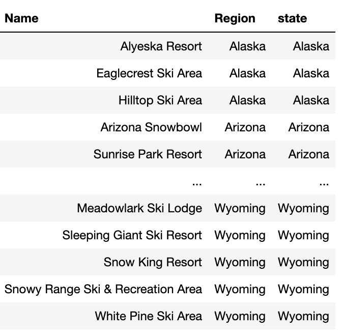

We saw earlier that these three columns had no missing values. Other issues, however, could be present.

Is `Name` always (or at least a combination of Name/Region/State) unique?

Are `region` and `state` synonymous?
            
We need to know if all resort names are unique. Duplicate names could result in double counting of values, which could lead us to draw erroneous conclusions.

### 2.4.3 Find duplicate resort names
>All resort names are not unique.

```python
 ski_data['Name'].value_counts().head()
 ```

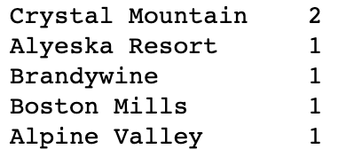

 We see there are two resorts named Crystal Mountain. This warrants further investigation. We'll use our Region and state data to broaden our understanding of what we are witnessing.

Here we concatenate the string columns 'Name' and 'Region' and count the values again (as above).

```python 
(ski_data['Name'] + ', ' + ski_data['Region']).value_counts().head()
```  

Since value_counts() sorts in descending order, our application of the head() method, which returns the first five rows of a data frame, implies the rest of the counts must also be 1. 

>Hence, we know there is only one Crystal Lake in any given region. But what about a view of the data from the state level?

>The two Crystal Mountain resorts are in different states. We see this is the case in the output below.

```python 
ski_data[ski_data['Name'] == 'Crystal Mountain']
```

    Name	            Region	    State
    _____________________________________________________
    Crystal Mountain	Michigan	Michigan
    Crystal Mountain	Washington	Washington
    2 rows × 27 columns

Based on this, we conclude the duplicated resort name was not an error.

### 2.4.4 Region And State
The meaning of Region is not immediately obvious. Are regions the same as states? What's the relationship between a Region and a state? In how many cases do the two variables differ?

We need to calculate the number of times Region does not equal state.

```python 
print("A resort's region and state are different " + str((ski_data.Region != ski_data.state).sum()) + ' times.')
```

>The answer to the question posed above is no: Regions and states are not always the same. A resort's region and state are different 33 times.

Below, we tabulate the number of distinct regions, in search of what, precisely, constitutes a region.

```python 
ski_data['Region'].value_counts()
```

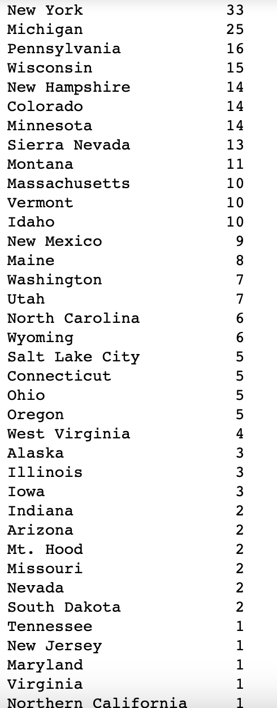

A casual inspection of the data reveals states can contain multiple regions, though this is not always the case.
>From this data, however, we can infer that states tend to contain more than one region.

>Further digging reveals that California has the most regions whose names are not coextensive with that of the state in which they reside: 20 are called Sierra Nevada and just 1 is referred to as Northern California.

```python 
(ski_data[ski_data.Region != ski_data.state].groupby('state')['Region'].value_counts())
```

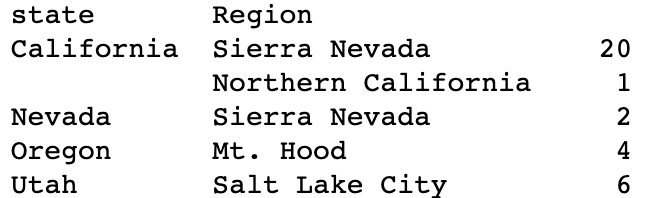


### 2.4.5 Distribution Of Resorts By Region And State
Below, we examine where our resorts are located.
```python
fig, ax = plt.subplots(1, 2, figsize=(12,8))
ski_data.Region.value_counts().plot(kind='barh', ax=ax[0])
ax[0].set_title('Region', fontsize=15)
ax[0].set_xlabel('Count', fontsize=15)
ski_data.state.value_counts().plot(kind='barh', ax=ax[1])
ax[1].set_title('State', fontsize=15)
ax[1].set_xlabel('Count', fontsize=15)
Change label size inspired by https://stackoverflow.com/questions/6390393
ax[0].tick_params(axis='y', which='major', labelsize=13)
ax[1].tick_params(axis='y', which='major', labelsize=13)
plt.subplots_adjust(wspace=0.5);
```

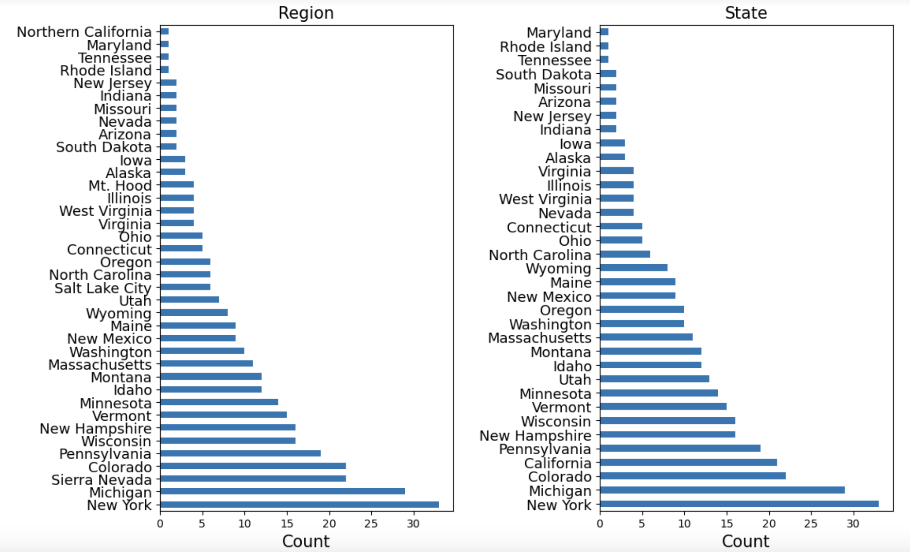

>Clearly, New York accounts for the majority of resorts. Our client's resort is in Montana, which ranks 11th in our regional count and 12th in our state count. 

We should think carefully about how, or whether, we use this information. Does New York command a premium because of its proximity to a large population center? Even if a resort's state were a useful predictor of ticket price, our main interest lies in Montana. Would we want a model that is skewed for accuracy by New York? Should we just filter for Montana and create a Montana-specific model? This would slash our available data volume. It's impossible to resolve this issue at present. We will circle back to it later in our study and stick to data wrangling (a/k/a "cleaning") for the moment.

### 2.4.6 Distribution Of Ticket Price By State
Our primary focus is Big Mountain resort in Montana. A salient question to ask is whether or not the state in which a resort is located gives us any clue as to what our primary target variable should be (weekend or weekday ticket prices)? Restated, what do AdultWeekday and AdultWeekend prices look like across state lines?

#### 2.4.6.1 Average weekend and weekday price by state
A cursory glance at average ticket prices across states for both `AdultWeekday` and `AdultWeekend` reveals weekday prices are consistently lower than weekend prices, with few exceptions.

Here, we calculate average weekday and weekend price by state and sort by the average of the two.

```python 
state_price_means = ski_data.groupby('state')[['AdultWeekday', 'AdultWeekend']].mean()
```
The table below gives us a sense of whether our target resort is priced competitively.

```python
python state_price_means.head(16)
```

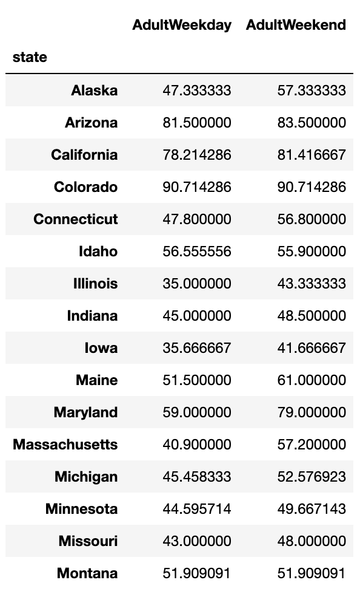
While this is helpful if we wish to take only a passing glance at our data on a relative basis, we can do much better. We can chart average weekday and weekend prices for all resorts within each state.

```python 
(state_price_means.reindex           (index=state_price_means.mean(axis=1)
.sort_values(ascending=False)
    .index)
    .plot(kind='barh', figsize=(10, 10), title='Average ticket price by State'))
plt.xlabel('Price ($)');
```

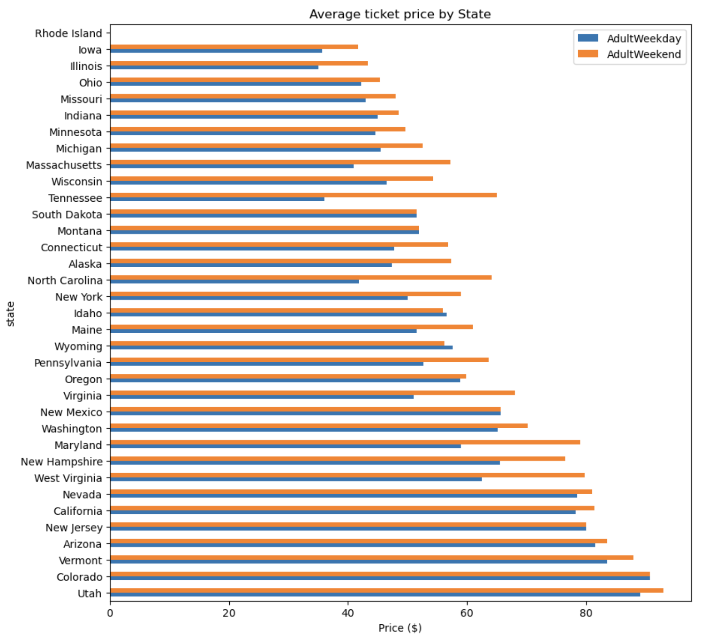

The figure above has two columns for each state, one for the average price of each type of ticket. This tells us how average ticket prices vary from state to state. Note that there are many destinations where one or both ticket prices are higher than those in Montana. This suggests upside potential may exist with respect to ticket prices, but nothing definitive can be said at the moment. 

We can, however, get more insight into the difference in the distributions between states.

#### 2.4.6.2 Distribution of weekday and weekend price by state
Here, we transform (i.e., melt) our data frame into one in which there is a single column for price with a new categorical column that represents the ticket type.

```python 
ticket_prices = pd.melt(ski_data[['state', 'AdultWeekday', 'AdultWeekend']], id_vars='state', var_name='Ticket', value_vars=['AdultWeekday','AdultWeekend'], value_name='Price') ticket_prices.head()
```

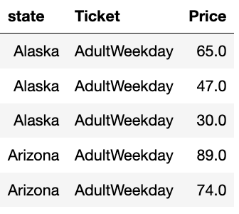

Our ticket price and state data are now in a format we can pass to Seaborn's boxplot function to create boxplots of the ticket price distributions for each ticket type by state.

```python
plt.subplots(figsize=(12, 8))
sns.boxplot(x='state', y='Price', hue='Ticket', data=ticket_prices)
plt.xticks(rotation='vertical')
plt.ylabel('Price ($)')
plt.xlabel('State')
plt.title('Distribution of Adult Weekend and Adult Weekday Ticket Prices by State');
```
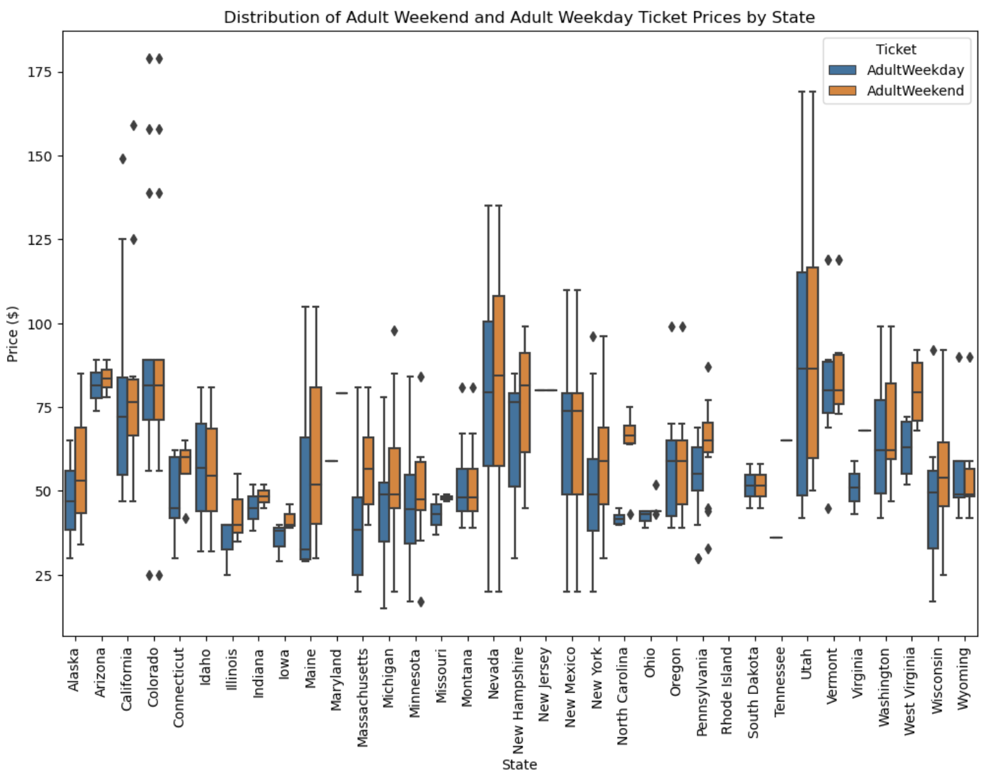

Aside from some relatively expensive ticket prices in California, Colorado, and Utah, most prices appear to lie in a broad band from around $25 to $125. 

Some states show more variability than others. Montana and South Dakota, for example, both show fairly little price variance. Nevada and Utah, on the other hand, exhibit significant price diversity.

>This exploration returns us to one of our fundamental questions: Do we have a target variable? We could model one ticket price, both prices, or use the difference between the two as a feature. Furthermore, how should we use our State data? There are several options including the following:

* disregard State completely
* retain all State information
* retain State in the form of Montana vs not Montana, as our target resort is in Montana
* examine states that abut Montana only

### 2.4.7 Numeric Features
In this section, we turn our attention to cleaning numeric features not discussed earlier.

#### 2.4.7.1 Numeric data summary
Below, we present a statistical summary of numeric features.

```python 
ski_data.describe().T
```

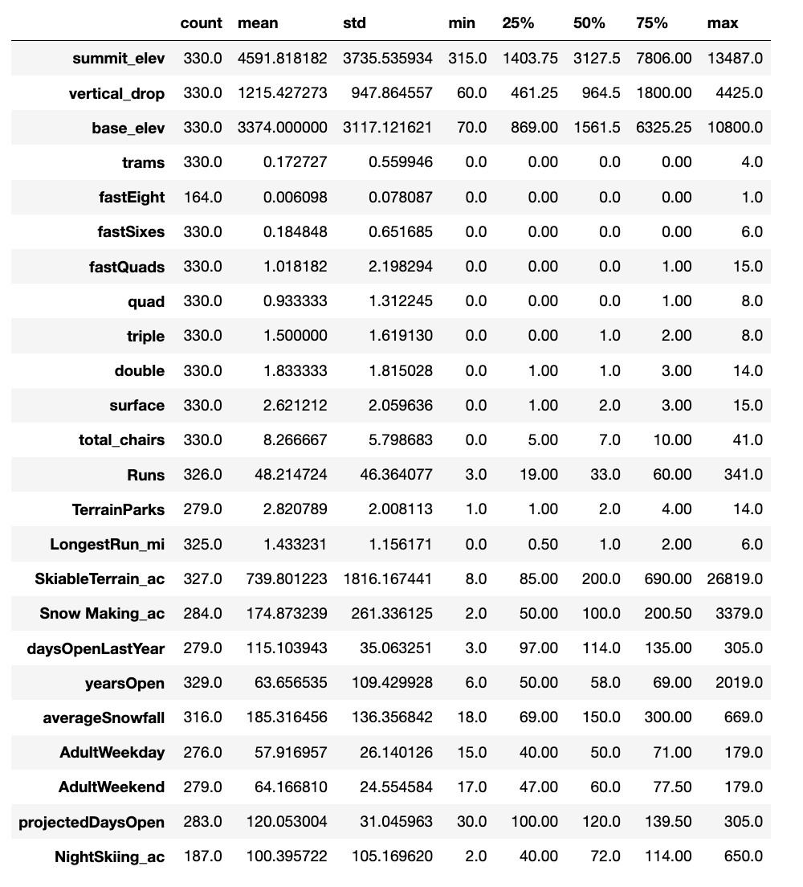

Recall, we're missing the ticket prices for ~16% of resorts. We will drop those records. Additionally, we may have a weekend price and not a weekday price or vice versa. For now, we want to keep any price data we have.

```python
missing_price = ski_data[['AdultWeekend', 'AdultWeekday']].isnull().sum(axis=1)
missing_price.value_counts()/len(missing_price) * 100
0    82.424242
2    14.242424
1     3.333333
dtype: float64
```
As shown above, just over 82% of resorts have no missing ticket prices, 3% are missing one price, and 14% are missing both. We will, not, however, uncritically drop the missing 14% just yet. It's possible information about the distributions of other features lies in that 14% of the data for which we have no price.

#### 2.6.4.2 Distributions Of Feature Values
Although we are still in the 'data wrangling' phase of our study, rather than exploratory data analysis, looking at feature distributions is warranted. Here, we examine whether distributions look plausible or wrong. Below, we present the distributions of our features.

```python 
ski_data.hist(figsize=(15,10))
plt.subplots_adjust(hspace=.5);
```

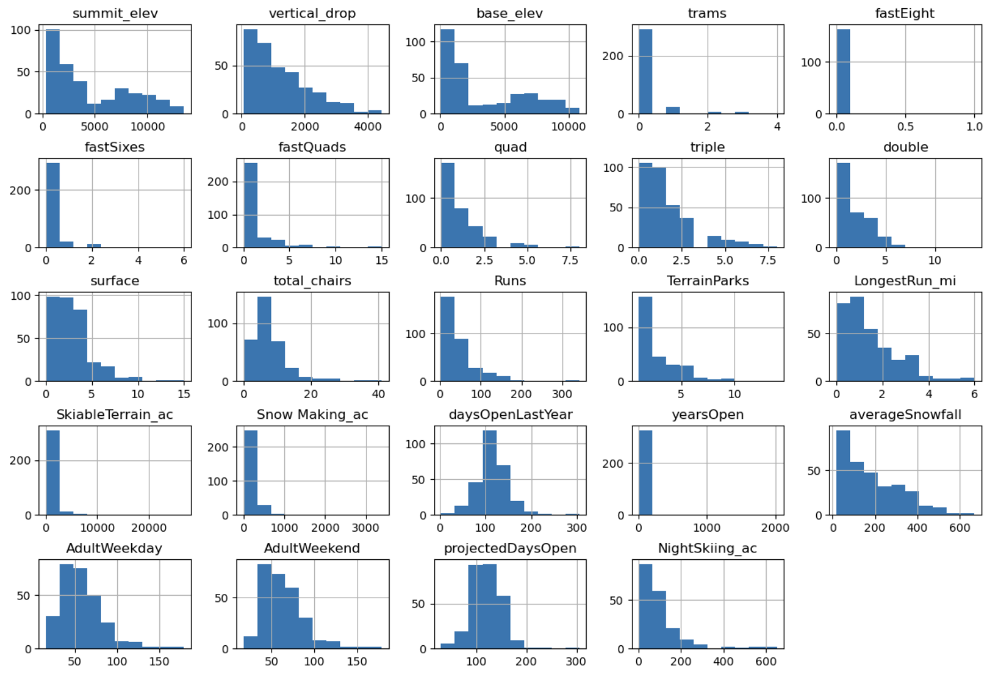

What features do we have possible cause for concern about and why?

* `SkiableTerrain_ac` because values are clustered down the low end,

* `Snow Making_ac` for the same reason,

* `fastEight` because all but one value is 0 so it has very little variance, and half the values are missing,

* `fastSixes` raises a red flag; it has more variability, but still mostly 0,

* `trams` also may get a red flag for the same reason,

* `yearsOpen` because most values are low but it has a maximum of 2019, which strongly suggests someone recorded a calendar year rather than number of years.

    ##### 2.6.4.2.1 **`SkiableTerrain_ac`**
    The distribution of skiable terrain looks odd. As it so happens, one resort has a massive amount of skiable terrain: Silverton Mountain, Colorado.

```python
    ski_data[ski_data.SkiableTerrain_ac > 10000].T
```

```python
    Name	Silverton Mountain
    Region	Colorado
    state	Colorado
    summit_elev	13487
    vertical_drop	3087
    base_elev	10400
    trams	0
    fastEight	0.0
    fastSixes	0
    fastQuads	0
    quad	0
    triple	0
    double	1
    surface	0
    total_chairs	1
    Runs	NaN
    TerrainParks	NaN
    LongestRun_mi	1.5
    SkiableTerrain_ac	26819.0
    Snow Making_ac	NaN
    daysOpenLastYear	175.0
    yearsOpen	17.0
    averageSnowfall	400.0
    AdultWeekday	79.0
    AdultWeekend	79.0
    projectedDaysOpen	181.0
    NightSkiing_ac	NaN
```
>We'll Google this resort to see if there is anything unusual to be found at Silverton.

Spot checking the data, we see our top and base elevation values agree, but **the skiable area is blatantly wrong.** Our data set says this value is 26,819, but the value we just looked up is 1,819. The last three digits agree. This looks like human error. We can confidently replace the incorrect value with the one we've just found. Had we access to the client, we would report this and ask for the correction.
#### Replace `SkiableTerrain_ac` value with the correct value

```Python
ski_data.loc[39, 'SkiableTerrain_ac'] = 1819
```
What does the distribution of skiable area look like now?

```Python
ski_data.SkiableTerrain_ac.hist(bins=30)
plt.xlabel('SkiableTerrain_ac')
plt.ylabel('Count')
plt.title('Distribution of skiable area (acres) after replacing erroneous value');
```

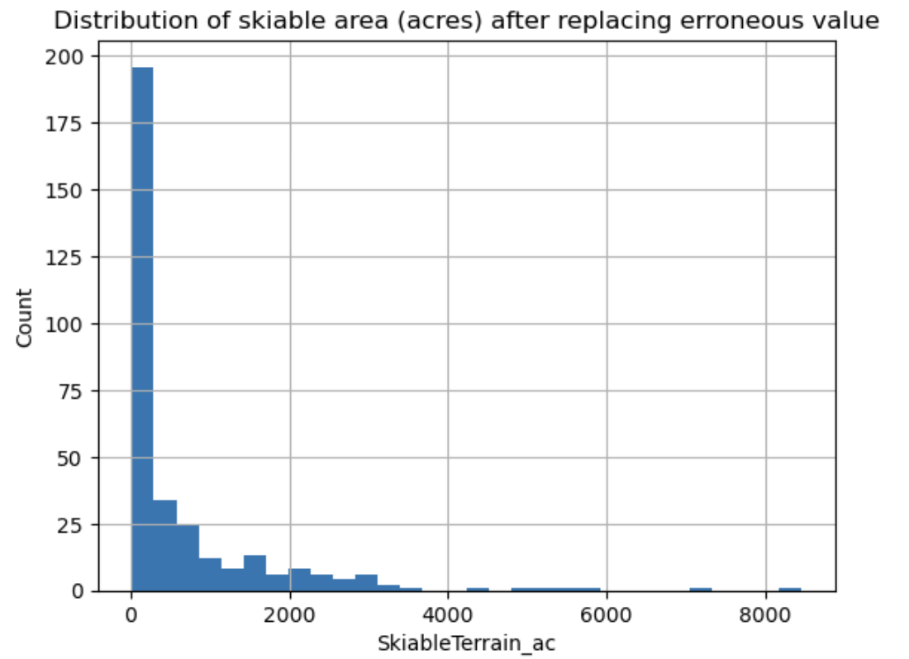

The chart above has a long-tailed distribution. The strong positive skew is a statistical artifact of the data's inability to go below zero. To be sure, there are extreme values, but the above distribution is plausible.

##### 2.6.4.2.2 **`Snow Making_ac`**
Our snow making data exhibits a heavy, positive skew. Is this the influence of an outlier?

```Python
ski_data['Snow Making_ac'][ski_data['Snow Making_ac'] > 1000]
11    3379.0
18    1500.0
Name: Snow Making_ac, dtype: float64
```

Observation 11 appears to be an outlier.

```Python
ski_data[ski_data['Snow Making_ac'] > 3000].T
```
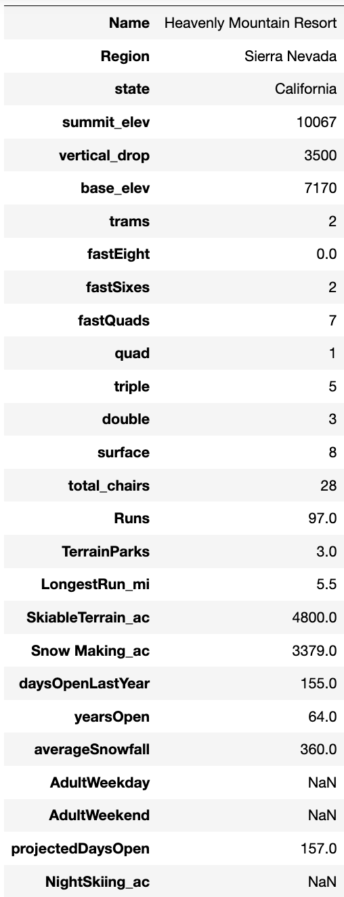

While this is vaguely interesting, we have no ticket pricing information at all for this resort, so we will drop this observation from our data frame.

```Python
ski_data.drop([11], axis=0, inplace=True)
```
##### 2.6.4.2.3 **`fastEight` & `yearsOpen`**
Below, we explore the fastEight values more closely.
```python
ski_data.fastEight.value_counts()
```
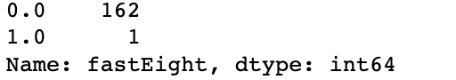

Since most values are either missing (i.e., zero), we can safely drop the `fastEight` feature.

```python
ski_data.drop(columns='fastEight', inplace=True)
```
##### 2.6.4.2.4 **`yearsOpen`**
The distribution of `yearsOpen` has caught our eye. How many resorts have purportedly been open for more than 100 years?

```python
ski_data[ski_data.yearsOpen > 100].T
```

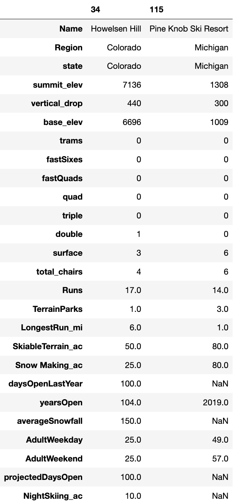

>One resort has been open for 104 years. The other has allegedly been open for 2019 years. This is an obvious error, so we drop the observation.

```python
ski_data.drop([115], axis=0, inplace=True)
```
What does the distribution of `yearsOpen` look like if we exclude just the obviously wrong one?

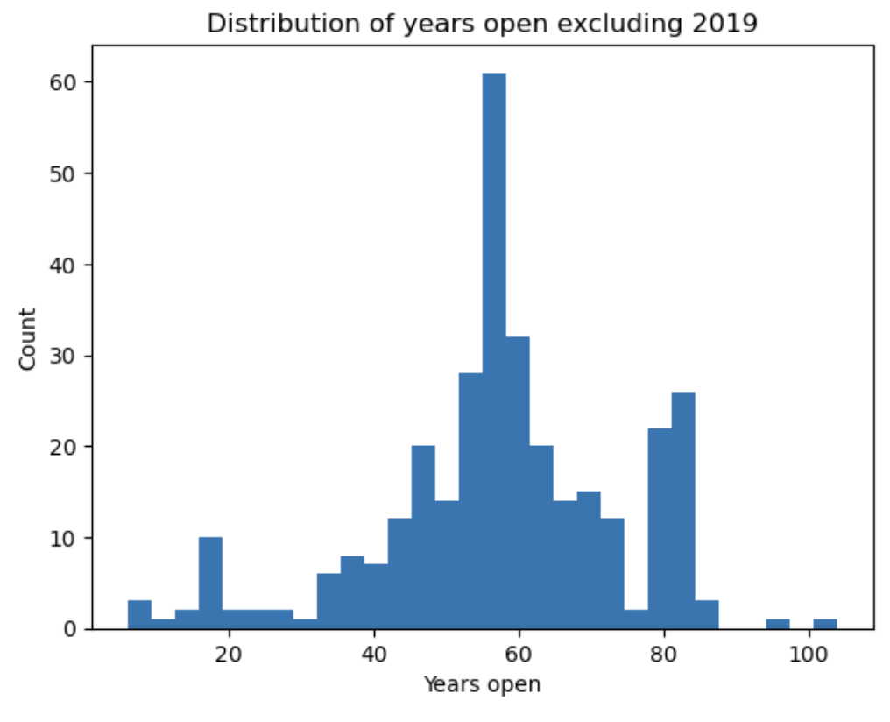

```python
    plt.hist(ski_data[ski_data.yearsOpen < 1000]['yearsOpen'], bins=30)
    plt.xlabel('Years open')
    plt.ylabel('Count')
    plt.title('Distribution of years open excluding 2019');
```

The above distribution of years seems entirely plausible.

Let's review the summary statistics for the years under 1000.

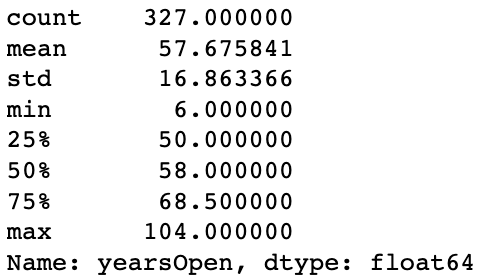

>The newest resort has been open for 6 years, while the oldest has been open for 104. We see no reason to doubt that our distribution of `yearsOpen` data is now accurate.

##### 2.6.4.2.4 `fastSixes` and `Trams`
These features do not raise major concerns, but we will take care in using them.

## 2.7 Derive State-wide Summary Statistics For Our Market Segment
Many features in our data pertain to chairlifts, in addition to overall skiable area. Features that we may be interested in are:

* TerrainParks
* SkiableTerrain_ac
* daysOpenLastYear
* NightSkiing_ac

These are features it makes sense to sum.

```python
state_summary = ski_data.groupby('state').agg(
    resorts_per_state=pd.NamedAgg(column='Name', aggfunc='size'), 
    state_total_skiable_area_ac=pd.NamedAgg(column='SkiableTerrain_ac', aggfunc='sum'),
    state_total_days_open=pd.NamedAgg(column='daysOpenLastYear', aggfunc='sum'),
    state_total_terrain_parks=pd.NamedAgg(column='TerrainParks', aggfunc='sum'),
    state_total_nightskiing_ac=pd.NamedAgg(column='NightSkiing_ac', aggfunc='sum')
).reset_index()
```
```python
state_summary.head()
```
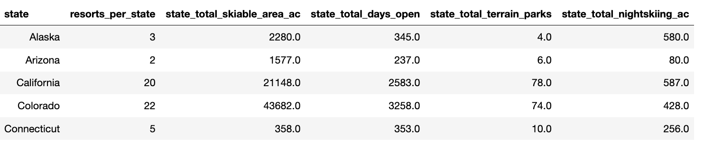

## 2.8 Drop Rows With No Price Data
We now return to the features that speak directly to price: `AdultWeekend` and `AdultWeekday`. 

As before, we calculate the number of price values missing per row. This will obviously have to be either 0, 1, or 2, where 0 denotes no price values are missing and 2 denotes that both are missing.

```python
missing_price = ski_data[['AdultWeekend', 'AdultWeekday']].isnull().sum(axis=1)
missing_price.value_counts()/len(missing_price) * 100
```
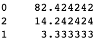

About 14% of the rows have no price data. Given these rows are missing data on both our potential target variables, they can be safely removed.

Below, we demonstrate how we used `missing_price` to remove rows from ski_data where both price values are missing.

```python
ski_data = ski_data[missing_price != 2]
```

## 2.9 Review Distributions
Let's review the distributions of numerical features now that we have made some changes.

```python
ski_data.hist(figsize=(15, 10))
plt.subplots_adjust(hspace=0.5);
```
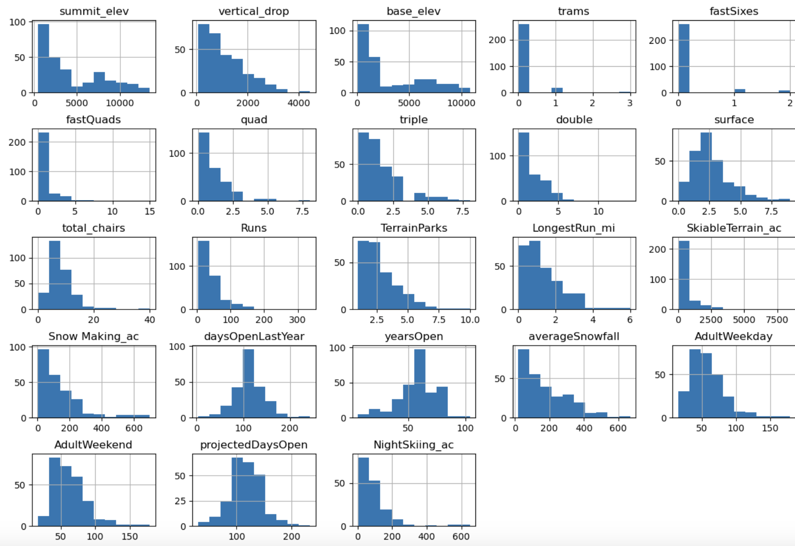

The distributions above seem much more reasonable. There are clearly some skewed distributions. We will keep an eye out for 1) the failure of our model to rate a feature as important when domain knowledge tells us it should be an issue and 2) extreme values that may influence our model.

## 2.10 Population data
Population and area data for the US states can be obtained from wikipedia. This table is useful because it allows us to proceed with an analysis that includes state sizes and populations. Intuitively, these are variables that could influence resort prices.

Here, we use the `read_html` method to read the table from the URL below
```python
states_url = 'https://simple.wikipedia.org/w/index.php?title=List_of_U.S._states&oldid=7168473'
usa_states = pd.read_html(states_url)
type(usa_states)
list
len(usa_states)
1
```
```python
usa_states = usa_states[0]
usa_states.head()
```

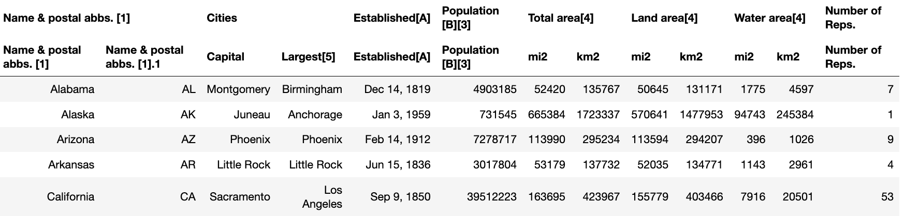

Note that two layers of column headings are at work in the above table.

Having a glimpse at the state data, we pull the date established data from the table:

```python
established = usa_states.iloc[:, 4]
established
0     Dec 14, 1819
1      Jan 3, 1959
2     Feb 14, 1912
3     Jun 15, 1836
4      Sep 9, 1850
5      Aug 1, 1876
6      Jan 9, 1788
7      Dec 7, 1787
8      Mar 3, 1845
9      Jan 2, 1788
10    Aug 21, 1959
11     Jul 3, 1890
12     Dec 3, 1818
13    Dec 11, 1816
14    Dec 28, 1846
15    Jan 29, 1861
16     Jun 1, 1792
17    Apr 30, 1812
18    Mar 15, 1820
19    Apr 28, 1788
20     Feb 6, 1788
21    Jan 26, 1837
22    May 11, 1858
23    Dec 10, 1817
24    Aug 10, 1821
25     Nov 8, 1889
26     Mar 1, 1867
27    Oct 31, 1864
28    Jun 21, 1788
29    Dec 18, 1787
30     Jan 6, 1912
31    Jul 26, 1788
32    Nov 21, 1789
33     Nov 2, 1889
34     Mar 1, 1803
35    Nov 16, 1907
36    Feb 14, 1859
37    Dec 12, 1787
38    May 29, 1790
39    May 23, 1788
40     Nov 2, 1889
41     Jun 1, 1796
42    Dec 29, 1845
43     Jan 4, 1896
44     Mar 4, 1791
45    Jun 25, 1788
46    Nov 11, 1889
47    Jun 20, 1863
48    May 29, 1848
49    Jul 10, 1890
Name: (Established[A], Established[A]), dtype: object
```
We want each state's name, population, and total area (square miles). To do so, we extract columns 0, 5, and 6 and use the dataframe's `copy()` method.
```python
usa_states_sub = usa_states.iloc[:, [0,5,6]].copy()
usa_states_sub.columns = ['state', 'state_population', 'state_area_sq_miles']
usa_states_sub.head()
```
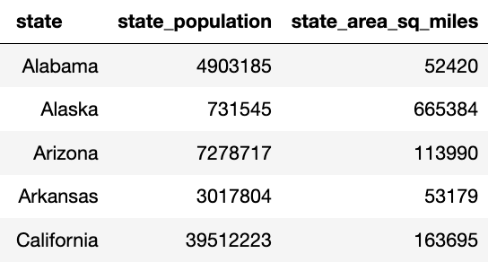

Below, we check whether all states for which we have ski data are accounted for.  By finding the states in `state_summary` that are not in `usa_states_sub`

```python
missing_states = set(state_summary.state) - set(usa_states_sub.state)
missing_states

{'Massachusetts', 'Pennsylvania', 'Rhode Island', 'Virginia'}
```

It appears as though we are missing data on certain states.

The website data contains a reasonable explanation for why 'Massachusetts', 'Pennsylvania', 'Rhode Island', and 'Virginia' are missing from usa_states_sub: There are brackets and abbreviations after these names.

```python
usa_states_sub.state[usa_states_sub.state.str.contains('Massachusetts|Pennsylvania|Rhode Island|Virginia')]
20    Massachusetts[C]
37     Pennsylvania[C]
38     Rhode Island[D]
45         Virginia[C]
47       West Virginia
Name: state, dtype: object
```

We should delete the square brackets seen above and their contents then try again.

```python
usa_states_sub.state.replace(to_replace='\[.*\]', value='', regex=True, inplace=True)
usa_states_sub.state[usa_states_sub.state.str.contains('Massachusetts|Pennsylvania|Rhode Island|Virginia')]
20    Massachusetts
37     Pennsylvania
38     Rhode Island
45         Virginia
47    West Virginia
Name: state, dtype: object
```

Having edited the data, let's verify that all states are now present.

```python
missing_states = set(state_summary.state) - set(usa_states_sub.state)
missing_states
set()
```

We now have an empty set for missing states. Thus, we confidently add the population and state area columns to our ski resort data.

```python
    state_summary = state_summary.merge(usa_states_sub, how='left', on='state')
    state_summary.head()
```
We will merge our data sets in our next notebook, in which we conduct a formal exploratory data analysis.

## 2.11 Target Feature
Finally, we return to our most important question: Which ticket price(s) will we model?

```python
pythonski_data.plot(x='AdultWeekday', y='AdultWeekend', kind='scatter');
```

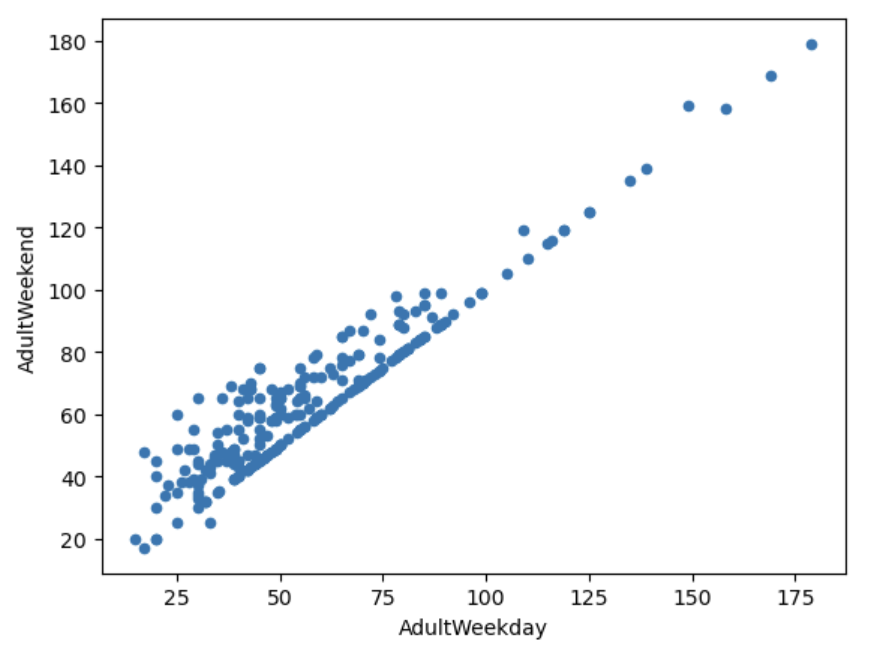

There is a clear line where `AdultWeekend` and `AdultWeekday` prices are equal. Weekend prices being higher than weekday prices seem restricted to sub $100 ticket price resorts. Recall from the boxplot earlier that the distributions for weekday and weekend prices in Montana seemed equal. This is confirmed by the table below.

```python
ski_data.loc[ski_data.state == 'Montana', ['AdultWeekend','AdultWeekday']]
```

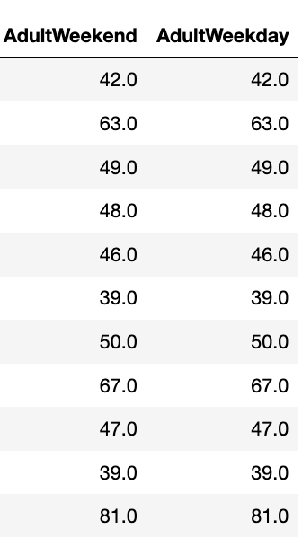

Below, we see -- once again -- that weekend prices have the fewest missing values of the two ticket types, so we drop the weekday prices and keep only those rows that have weekend price. This leaves `AdultWeekend` price as our official target.

```python
ski_data[['AdultWeekend', 'AdultWeekday']].isnull().sum()
AdultWeekend    4
AdultWeekday    7
dtype: int64
ski_data = ski_data.copy(deep=True)
ski_data.drop(columns='AdultWeekday', inplace=True)
ski_data.dropna(subset=['AdultWeekend'], inplace=True)
```

Having made these adjustments, we should check the overall shape of our data frame to ascertain if it is reasonable.

```python
ski_data.shape
(278, 25)
```
This isn't too far off from our original data frame.
### 2.11.1 Number Of Missing Values By Row - Resort
Having dropped rows missing the desired target ticket price, what degree of missingness exists in the remaining rows?

```python
missing = pd.concat([ski_data.isnull().sum(axis=1), 100 * ski_data.isnull().mean(axis=1)], axis=1)
missing.columns=['count', '%']
missing.sort_values(by='count', ascending=False).head(10)
```
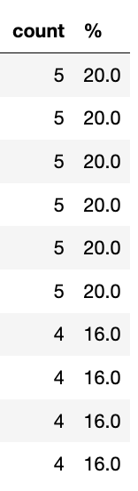

These seem curiously quantized...
```python
missing['%'].unique()
array([ 0.,  4.,  8., 12., 16., 20.])
```

Yes, the percentage of missing values per row appear in multiples of 4.

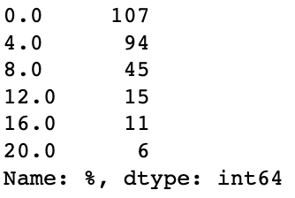

It's as if values have been removed artificially. Nevertheless, we don't know how useful the missing features are in predicting ticket price. Thus, we shouldn't just drop the rows that are missing data.

```python
ski_data.info()
<class 'pandas.core.frame.DataFrame'>
Int64Index: 278 entries, 0 to 329
Data columns (total 25 columns):
 #   Column             Non-Null Count  Dtype  
---  ------             --------------  -----  
 0   Name               278 non-null    object 
 1   Region             278 non-null    object 
 2   state              278 non-null    object 
 3   summit_elev        278 non-null    int64  
 4   vertical_drop      278 non-null    int64  
 5   base_elev          278 non-null    int64  
 6   trams              278 non-null    int64  
 7   fastSixes          278 non-null    int64  
 8   fastQuads          278 non-null    int64  
 9   quad               278 non-null    int64  
 10  triple             278 non-null    int64  
 11  double             278 non-null    int64  
 12  surface            278 non-null    int64  
 13  total_chairs       278 non-null    int64  
 14  Runs               275 non-null    float64
 15  TerrainParks       234 non-null    float64
 16  LongestRun_mi      273 non-null    float64
 17  SkiableTerrain_ac  276 non-null    float64
 18  Snow Making_ac     241 non-null    float64
 19  daysOpenLastYear   233 non-null    float64
 20  yearsOpen          277 non-null    float64
 21  averageSnowfall    268 non-null    float64
 22  AdultWeekend       278 non-null    float64
 23  projectedDaysOpen  236 non-null    float64
 24  NightSkiing_ac     164 non-null    float64
dtypes: float64(11), int64(11), object(3)
memory usage: 56.5+ KB
ski_data.shape
(278, 25)
```
## 2.12 Saving Our Data
We save our work to our data directory, separately. Note that we were provided with the data in raw_data, and we should save derived data in a separate location. This guards against overwriting our original data.

```Python
datapath = '../data'
save_file(ski_data, 'ski_data_cleaned.csv', datapath)
Writing file.  "../data/ski_data_cleaned.csv"
```

We'll save the `state_summary` data separately.

```Python
datapath = '../data'
save_file(state_summary, 'state_summary.csv', datapath)
Writing file.  "../data/state_summary.csv"
```
