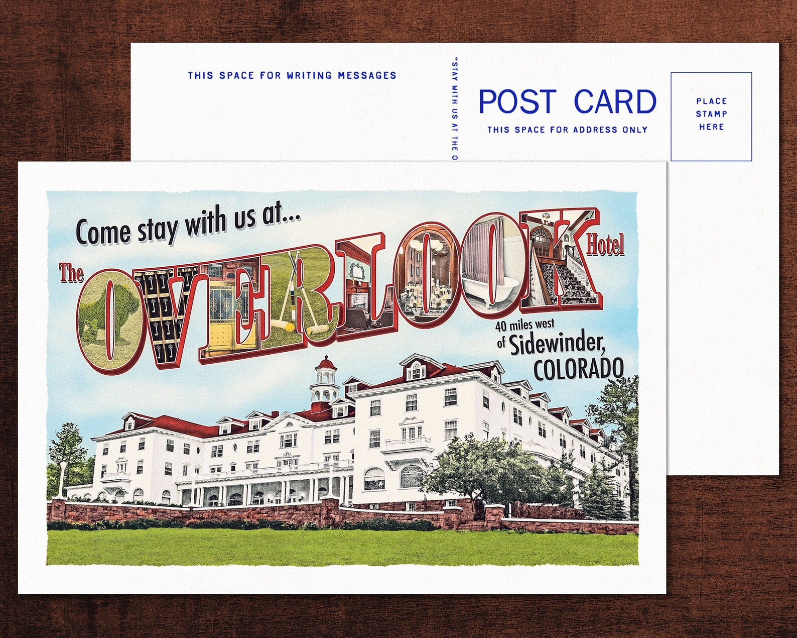
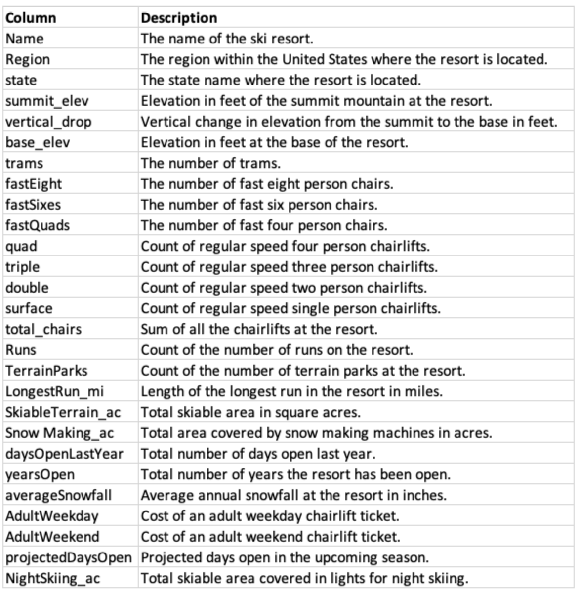

# Ticket Pricing at Big Mountain Resort

***The Overlook Hotel from Stephen King's "The Shining"***
***(Source: [Etsy](https://www.etsy.com/listing/729040276/the-overlook-hotel-postcard-stephen-king))*** 

Running a business can be boiled down to three simple questions: 

1. What should we invest in?
2. How should we pay for it?
3. How should we return value to stakeholders?

Management at Big Mountain Resort (a/k/a "the Company", "the Client", "the resort") was struggling with questions one and three. The Resort had recently added a chairlift, which increased visitor mobility around the complex. The lift also increased operating costs by $1.54 million in the current season. 

There's nothing wrong with an investment in a lift at a ski resort per se, but management was uncertain which asset types actually added value to the customer's experience of Big Mountain. Restated, the Company made an investment they were unsure visitors would value. Moreover, management had yet to determine whether or not the resort's asset portfolio (e.g., lifts, runs, amenities, etc.) could support the current ticket price or, potentially, a higher one.

We were called in to determine which assets were valued most by customers and resolve the question of whether or not the resort's tickets were appropriately priced.

# The Data
Data were provided to us in a flat file (CSV format). The file contained 330 rows and 27 columns. Each row represented a U.S. ski resort. The features (i.e., columns) below were provided to support our analysis.
 State-level population data were pulled from Wikipedia.com.   

# Data Wrangling/Cleaning
Data for Big Mountain was complete in all respects. The biggest surprise found during the wrangling process was the existence of two potential target variables: `AdultWeekday` and `AdultWeekend`. The `AdultWeekday` variable was dropped, as it was missing slightly more data points than `AdultWeekend`. The loss of information was minimal. Only 47 were missing both types of ticket data, and many resorts offered ticket prices that were the same during both the week and weekend.

Beyond the existence of two target variables, the key takeaways from the data wrangling phase of our study were fairly commonplace. `fastEight` was dropped as a potential feature because over 50% of our resorts did not have a value for this particular variable. The presence of `Region` and `state` variables caused some initial confusion, however, it soon became clear that the two were not isomorphic. A resort's `Region` and `state` differed 33 times. California had the most regions, but New York was the industry leader in total number of resorts measured by region or state. Montana ranked 11th by `Region` and 12th by `state`.

A boxplot revealed average ticket price variance was significant when viewed across state lines. The distribution of ticket prices for the `AdultWeekend` tickets in Montana was fairly narrow and mirrored the distribution for weekday tickets. This stands in contrast to ski markets including, but not limited to, Utah, Vermont, and California.

Most features exhibited a distinctive positive skew owing to the inability of the variable to take on a value less than zero. Erroneous data appeared as outliers in the `SkiableTerrain_ac` and `yearsOpen` columns, as well as `SnowMaking_ac`. `SkiableTerrain_ac` was corrected using data from the internet. The remaining outliers mentioned were dropped.

The following features were engineered by summation within each state:
* TerrainParks
* SkiableTerrain_ac
* daysOpenLastYear
* NightSkiing_ac

Only after reviewing all data did we drop rows containing no price data. This is a conservative approach to data wrangling. Rows missing price data may have data pertaining to other features than could provide insight when coompleting the wrangling process.

State population data was pulled from [Wikipedia](https://simple.wikipedia.org/w/index.php?title=List_of_U.S._states&oldid=7168473).
When aggregated, it was apparent missing data fell into quantiles, suggesting human intervention. This was no surprise, given that our client is fictional.

# Data Exploration
We entered the data exploration phase of study with a pared-down data set (a/k/a "design matrix") of 278 rows and 25 features including `AdultWeekend` ticket prices, which will be extracted from our matrix and isolated before modelling. Additionally, we had a design matrix of state-level data containing summations for the following variables:
* TerrainParks
* SkiableTerrain_ac
* daysOpenLastYear
* NightSkiing_ac

The summation process gave rise to the following features: 
* state 
* resorts_per_state 
* state_total_skiable_area_ac
* state_total_days_open
* state_total_terrain_parks 
* state_total_nightskiing_ac

Combining our data sets provided us with valuable insights about our resort, Montana, and their standings relative to their competitors.

Montana claimed the top spot in skiable acreage in its immediate vicinity defined here as including Idaho, Wyoming, and South Dakota. If we broaden our perspective, Colarado and Utah come in first and second, respectively, while Montana ranks third among the top 20 states with the most skiable area.

Skiable area didn't predict the resort count by state. The three states with the most resorts were New York, Michigan, and Colarado. Montana ranked 12th in our 35 state lineup. New York was also first in night skiing whereas Montana came in 8th.

The total days open seems to bear some resemblance to the number of resorts. This is reasonable. The more resorts in a state the greater the chances a resort will be open at any point in the season, thus, the state will have more ski days.

New Hampshire, however, made it into the top 5, despite being a small state that didn't make it into the top 5 for resorts per state. This is likely due both to its average annual snowfall of 60" to 150" and its proximity to New York and, oft overlooked, Connecticut. Montana took our 15th spot.

We looked at resorts per 100k people and 100 square miles. Due to outliers and the data's inability to go below zero, both distributions had a distinct positive skew. 

Many states had between 8 and 11 resorts per 100k people, though a non-trivial number had between 1 and 4. Vermont, Wyoming, New Hampshire, and Montana ranked first through fourth, respectively, regarding resorts per 100k.  

When looking at resorts per 100k square miles, most states have between 3 and 9 resorts. New Hampshire dominated the ranking, while Montana failed to make our top 10.
